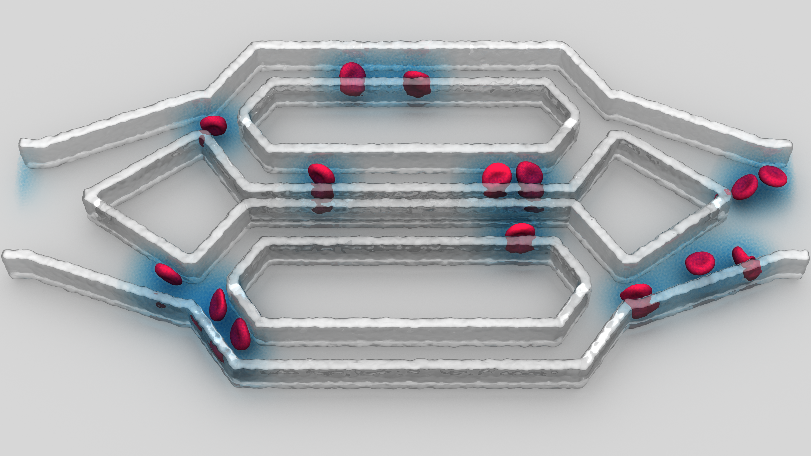

# user**MESO 2.5**

## Introduction

**userMESO 2.5** is a highly optimized hybrid CPU/GPU particle simulation package. This package has a code structure design that aligns with  **LAMMPS**, and is highly customizable. The package's programming language is CUDA C/C++ with MPI and OpenMP.

## Version History

**userMESO 2.5**

(Dated Aug 2018) **userMESO 2.5** (https://github.com/AnselGitAccount/USERMESO-2.0-mdpd) is an updated version of  **userMESO 2.0**. This version was developed by Ansel Blumers (then  intern at Idaho National Laboratory and PhD student at Brown University) and Yidong Xia (then at Idaho National Laboratory). Major updates in this version include the implementation of 1) the many-body DPD (mDPD) model for multi-fluid/phase flow [1]  and 2) a no-slip and no-penetration boundary condition for fluid flow in an arbitrarily complex geometry [2] for the mDPD model.

Reference

[1] https://aip.scitation.org/doi/abs/10.1063/1.4981136
[2] https://www.sciencedirect.com/science/article/pii/S0021999117308525

**userMESO 2.0**

(Dated Apr 2017) **userMESO 2.0** (https://github.com/AnselGitAccount/USERMESO-2.0) is an updated version of the original **userMESO** code. This version was developed by Ansel Blumers and Yu-Hang Tang (then at Brown University). Now it is possible to simulate advection, diffusion, and reaction processes with dissipative particle dynamics (tDPD). Another major upgrade is the ability to simulate red blood cells. Combining tDPD and the red blood cell model, the simulation of the chemical-releasing process from the red blood cells becomes realizable. 

The details regarding code implementation can be found at https://www.sciencedirect.com/science/article/pii/S0010465517301042

**userMESO**

 (Dated Oct 2016) **userMESO** (https://github.com/yhtang/MESO) was developed by Yu-Hang Tang (then at Brown University) to simulate molecular dynamics, classic dissipative particle dynamics, and smoothed particle dynamics. It integrates several algorithmic innovations that take advantage of CUDA devices:

- An atomic-free warp-synchronous neighbor list construction algorithm;
- A 2-level particle reordering scheme, which aligns with the cell list lattice boundaries for generating strictly monotonic neighbor list;
- A locally transposed neighbor list;
- Redesigned non-branching transcendental functions ($\sin$, $\cos$, pow, $\log$, $\exp$, etc.);
- An overlapped pairwise force evaluation and halo exchange using CUDA streams for hiding the communication and the kernel launch latency;
- Radix sorting with GPU stream support;
- Pairwise random number generation based on per-timestep binary particle signatures and the prepriority Tiny Encryption Algorithm.

The details regarding code implementation can be found at https://www.sciencedirect.com/science/article/pii/S0010465514002203

## Compilation Guide

### On Linux desktop

**==Important: do not install Nvidia GPU drivers with your Linux distro's software installer ==**

If you happen to have done so, we suggest you remote them. Follow Nvidia's official instruction to install CUDA Toolkit (e.g. version 9.2) including the GPU driver. Then check if the GPU(s) can be detected.

	cd ~/NVIDIA_CUDA-9.2_Samples/1_Utilities/deviceQuery
	make
	./deviceQuery

Set the required environment variales.

	export PATH=/usr/local/cuda/bin:${PATH}
	export LD_LIBRARY_PATH=/usr/local/cuda/lib64:$LD_LIBRARY_PATH
	export LIBRARY_PATH=/usr/local/cuda/lib64:$LIBRARY_PATH

Compile the source code as follows. To  know the compute capability version of your GPU, check https://en.wikipedia.org/wiki/CUDA

	cd <code_repository>/src
	make yes-molecule
	make yes-user-meso
	make meso ARCH=[sm_30|sm_35|sm_52|sm_60|sm_61|sm_70|...]

Run a test simulation (e.g. using 2 GPUs and 2 MPI ranks with 1 GPU/rank and 2 threads/rank)

	OMP_NUM_THREADS=2 mpirun -np 2 <lmp_meso> -i in.test

## Running a simple example
Simulation of a red blood cell in fluid.

> cd <working_copy>/exmaple/simple
>
> ../../src/lmp_meso -in tDPD_RBC_spec1_Single_GPU.in

## Single-node benchmark
Benchmark of RBC suspension in a single node. The simulations of different system volumes are timed.

> cd <working_copy>/example/single_node_benchmark
>
> ./run_file.sh

## Example Simulation Visualization
| Chemical-release of Red Blood Cells in a Microfluidic Device |
|:-------------------------------------------------------------|
||

## File Description
In addition to the source files in user**MESO** (program summary URL: http://cpc.cs.qub.ac.uk/summaries/AETN_v1_0.html), the following source files are included in user**MESO 2.0** package.

#### Transport dissipative particle dynamics
The files in this section are essential to the simulation of transport dissipative particle dynamics.
**atom_vec_tdpd_atomic_meso.cu/.h**
> These files contain the tdpd class declaration and implementation.

**pair_tdpd_meso.cu/.h**
> These files compute the pairwise interactions which includes forces and concentration fluxes.

**fix_nve_tdpd_meso.cu/.h**
> These files performs constant energy and volume integration to update position, velocity, and concentration for atoms in each timestep.

#### Red blood cell computation
The files in this section are solely needed to compute red blood cell dynamics.
**atom_vec_tdpd_rbc_meso.cu/.h**
> These files contain the tdpd class declaration and implementation that are specifically designed for red blood cells.

**angle_area_volume_meso.cu/.h**
> These files compute the angle term in the red blood cell model.

**bond_wlc_pow_all_visc_meso.cu/.h**
> These files compute the bond term in the red blood cell model.

**dihedral_bend_meso.cu/.h**
> These files compute the dihedral term in the red blood cell model.

#### Auxiliary
**compute_concent_tdpd_meso.ch/.h**
> These files sum the concentration of each species over all particles.

**dump_tdpd_meso.cu/.h**
> These files prints the coordinates and concentrations to an output file.

**fix_addconf_tdpd_meso.cu/.h**
> These files increases the concentration by a constant.

**fix_resetconc_tdpd_meso.cu/.h**
> These files reset the concentration to a value.
